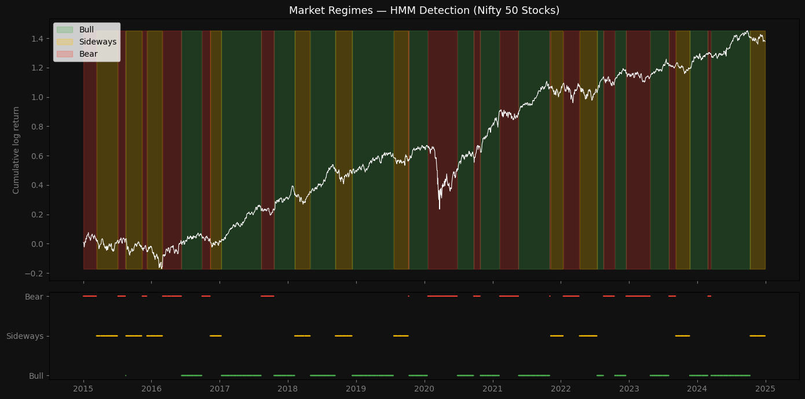
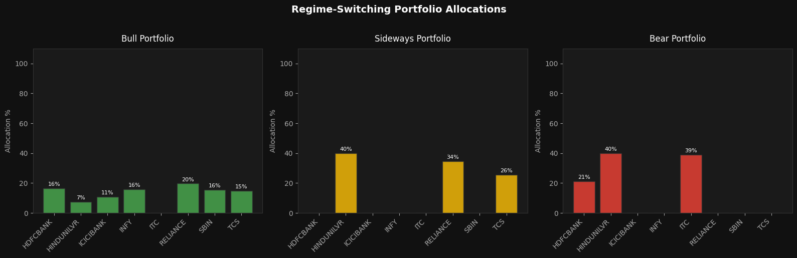
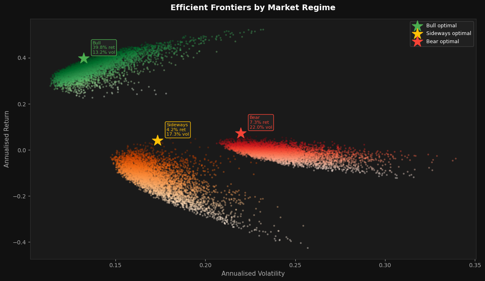
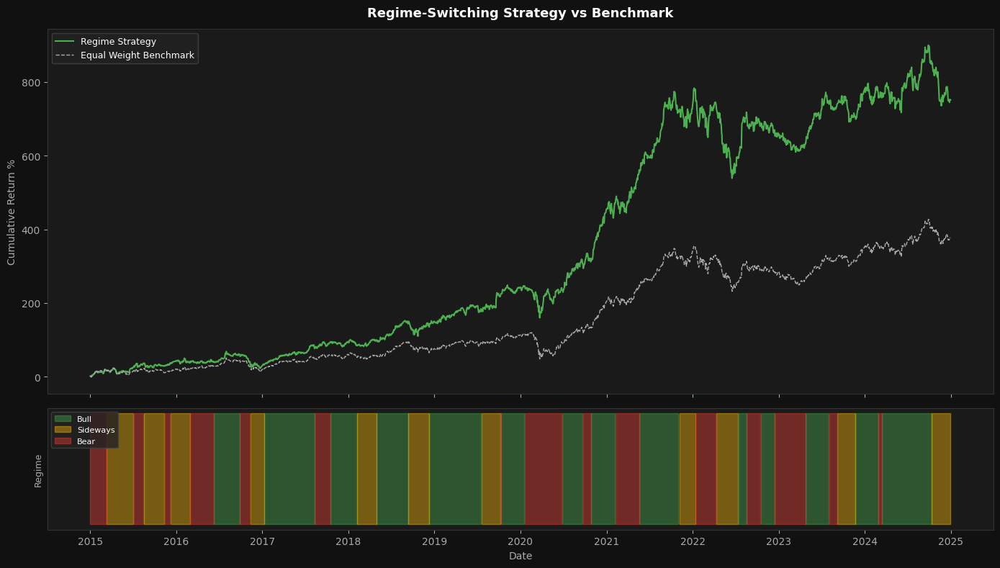

# Regime-Switching Portfolio Optimizer

A portfolio optimization system that detects market regimes using a Hidden Markov Model and dynamically allocates to regime-specific optimized portfolios. Built on 10 years of Nifty 50 data (2015–2024).

---

## Motivation

A standard portfolio optimizer uses one average covariance matrix computed across all market conditions and outputs one fixed portfolio. That portfolio is mediocre in every regime because it averages across fundamentally different market environments. By detecting regimes first, a separate optimized portfolio can be built for each mood — one specifically designed for the conditions the market is currently in.

---

## Step 1: Market Regime Detection

I started by downloading 10 years of daily stock price data (2015–2024) for 8 major Nifty 50 stocks using yfinance — Reliance, TCS, Infosys, HDFC Bank, ICICI Bank, SBI, HUL, and ITC. These stocks span different sectors giving a broad view of the Indian market.

I then converted raw prices into log returns. Log returns tell us how much each stock moved each day and work better mathematically than raw prices for statistical modeling.

Next I built a feature matrix. Instead of feeding all 8 stock returns directly into the model, I compressed each trading day into 4 summary numbers:

- **Average return across all 8 stocks that day** — captures market direction
- **Average absolute return across stocks** — captures same-day volatility
- **20-day rolling standard deviation** — captures sustained volatility over recent weeks
- **Drawdown from 60-day peak** — captures how deep a correction the market is in

I then trained a Hidden Markov Model with 4 hidden states on this feature matrix. The HMM reads through 10 years of daily data and identifies on its own that there are distinct market regimes — periods where the market behaves consistently differently. It learns what each regime looks like in terms of direction and volatility, and how likely the market is to stay in or switch between regimes day to day.

After training, I used the Viterbi algorithm to stamp every trading day with a regime label. Since I used 4 hidden states internally, I merged the two worst-performing states into one Bear regime, giving three final regimes — Bull, Sideways, Bear. I then applied a 60-day majority vote smoothing window to remove noisy day-to-day regime flipping, since real market regimes persist for weeks or months, not individual days.

**Final distribution across 2465 trading days:**

| Regime | Days | Character |
|--------|------|-----------|
| Bull | ~50% | Strong positive returns, lowest volatility |
| Sideways | ~27% | Near flat returns, moderate volatility |
| Bear | ~23% | Negative returns, highest volatility |

The model successfully identified real historical market events — the 2016 Nifty correction, 2018 IL&FS crisis, COVID crash in March 2020, 2022 rate hike selloff, and the 2023–24 bull run to all time highs.

---

## Step 2: Regime-Based Portfolio Optimization

After identifying the market regime for every trading day, I split the returns data into three separate buckets — all bull days, all sideways days, and all bear days. For each bucket I computed:

- **Mean return vector** — average daily return of each stock during that regime
- **Covariance matrix** — how stocks move together during that regime

The key insight is that these numbers look completely different across regimes. During bull periods, SBIN and ICICIBANK have the highest mean returns. During bear periods, they turn negative while ITC and HINDUNILVR stay positive. The covariance matrix also shifts — during bear periods stocks move more together because panic selling hits everything simultaneously.

I built a Sharpe ratio maximizer using scipy with two constraints — weights must sum to 1 (fully invested), and no single stock can exceed 40% (concentration cap).

**Resulting portfolios:**

| Stock | Bull | Sideways | Bear |
|-------|------|----------|------|
| RELIANCE | 20% | 34% | 0% |
| HDFCBANK | 16% | 0% | 21% |
| ICICIBANK | 11% | 0% | 0% |
| INFY | 16% | 0% | 0% |
| ITC | 0% | 0% | 39% |
| SBIN | 16% | 26% | 0% |
| HINDUNILVR | 7% | 40% | 40% |
| TCS | 15% | 0% | 0% |

The bear portfolio is purely defensive — zero allocation to banks, IT, and cyclicals. The optimizer figured this out entirely from the data without being told which stocks are defensive.

---

## Step 3: Efficient Frontier Visualization

To visualize the three portfolios I generated 5000 random portfolios for each regime and plotted them in risk-return space. The three frontiers sit in completely different regions:

- **Bull frontier** — top-left, high returns, low volatility
- **Sideways frontier** — middle, compressed returns, moderate volatility
- **Bear frontier** — bottom-right, most portfolios negative, high volatility

**Optimal portfolio for each regime (max Sharpe):**

| Regime | Ann. Return | Ann. Volatility |
|--------|-------------|-----------------|
| Bull | 39.8% | 13.2% |
| Sideways | 4.2% | 17.3% |
| Bear | 7.3% | 22.0% |

The current regime predictor takes the last 20 trading days, runs them through the fitted HMM, and outputs regime probabilities and recommended allocations. Based on data through end of 2024, the model predicted Bear regime with 63.6% confidence.

---

## Step 4: Out-of-Sample Backtesting

To validate without look-ahead bias, the backtest was run on 4 completely different stocks the HMM never saw during training — Bajaj Finance, Asian Paints, Sun Pharma, and Wipro. The regime labels from the HMM were applied to these unseen stocks and compared against an equal-weight passive benchmark.

**Results over 10 years (2015–2024):**

| Metric | Strategy | Benchmark |
|--------|----------|-----------|
| Annualised Return | 21.9% | 16.0% |
| Annualised Volatility | 19.8% | 18.9% |
| Sharpe Ratio | 1.10 | 0.84 |
| Max Drawdown | -27.7% | -32.7% |
| Total Return | 751.4% | 376.5% |

The regime-switching strategy delivered roughly double the total return of the passive benchmark while achieving a better Sharpe ratio and lower maximum drawdown.

**Known limitation:** The regime labels were generated by an HMM trained on the full 10-year dataset. In a live trading system, a rolling-window retraining approach would remove this limitation entirely and is a natural next extension of this project.

---

## Tech Stack

- **Python** — pandas, numpy, scipy, matplotlib
- **hmmlearn** — Gaussian HMM for regime detection
- **yfinance** — market data
- **scipy.optimize** — Sharpe ratio maximization

---

## Setup

```bash
pip install yfinance hmmlearn scipy matplotlib pandas numpy
```

Open `regime_portfolio.ipynb` and run all cells.
---

## How to Navigate

The project is a single Jupyter notebook — `regime_portfolio.ipynb` — structured in order. Run cells top to bottom.

**Cell structure:**

1. **Imports and data download** — downloads 8 Nifty 50 stocks via yfinance
2. **Log returns and feature matrix** — converts prices to returns, builds 4 features per day
3. **HMM fitting** — trains the regime detection model
4. **Regime decoding and smoothing** — labels every day as Bull / Sideways / Bear
5. **Regime visualization** — plots cumulative returns shaded by regime (`regime_plot.png`)
6. **Portfolio optimization** — builds 3 Sharpe-maximizing portfolios, one per regime (`portfolio_weights.png`)
7. **Efficient frontier** — plots all 3 frontiers on one chart (`efficient_frontiers.png`)
8. **Current regime predictor** — outputs today's recommended portfolio and allocations
9. **Out-of-sample backtest** — validates on 4 unseen stocks, compares against benchmark (`backtest.png`)

**Output files generated:**

| File | Description |
|------|-------------|
| `regime_plot.png` | HMM regime detection over 2015–2024 |
| `portfolio_weights.png` | Allocation breakdown per regime |
| `efficient_frontiers.png` | Risk-return frontier for all 3 regimes |
| `backtest.png` | Strategy vs benchmark cumulative returns |
